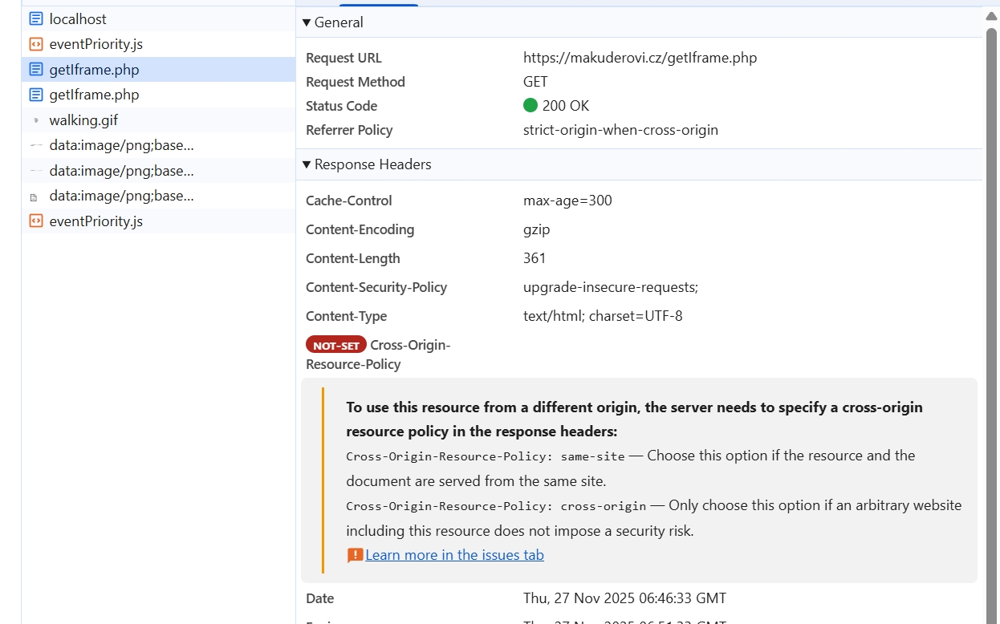

# Coep-iframe

## Prerequisites
- nodejs 20+

## Install
- npm install

## Run
- npm start

# Error

## Iframe COEP error
- example image
- 
- iframe request must returns headers: `Cross-Origin-Embedder-Policy: require-corp` and `Cross-Origin-Resource-Policy: cross-origin`

## External resources
- there are problem with COEP headers and external resources on the page
- all assets on the current domain are safe, but cross origin assets are not loaded by default

## External images
- external images needs to have attribute `crossOrigin` set to `anonymous`
- and image request needs to returns `cross-origin` header
